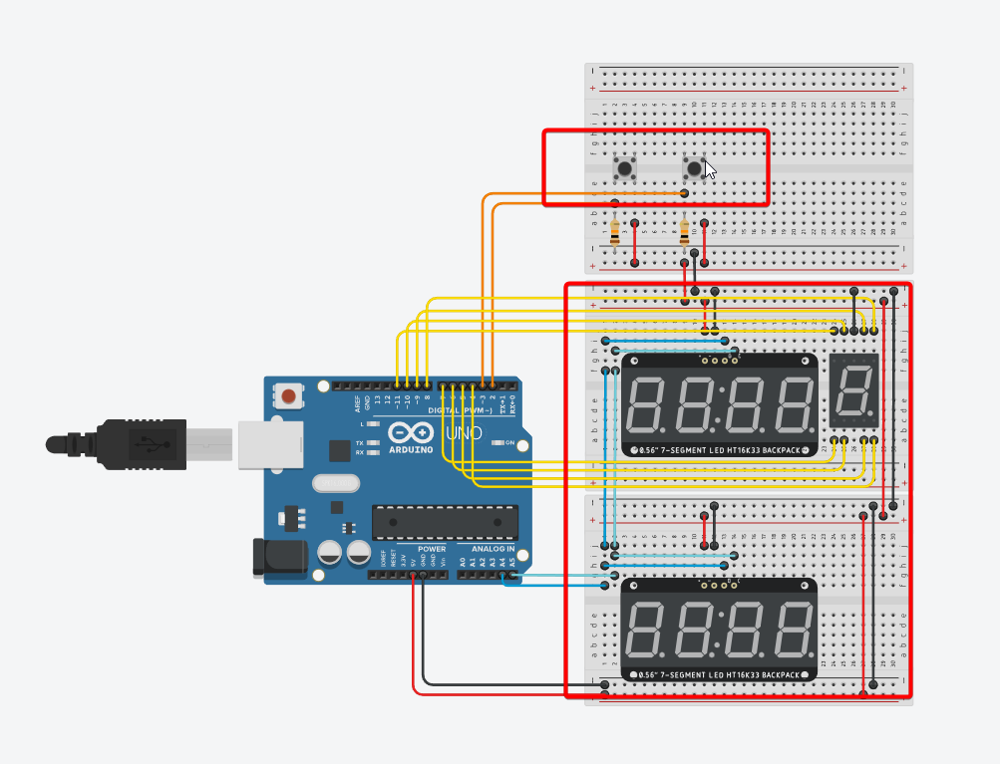

# Challenge - Tech Mahindra - Edge Computing

Este repositório faz parte das entregas do Challenge da Tech Mahindra do curso de engenharia de software na FIAP ( 2024 ).

A entrega é correspondente à matéria de Edge Computing.

## Alunos Participantes

- Douglas dos Santos Melo - RM: 556439
- Gabriel Danius Fachetti Barbosa - RM: 555747
- Henrique Borges de Castro Sanches - RM: 557959
- Matheus Marcelino Dantas da Silva - RM: 556332
- Vitor Chaves de Lima Coelho - RM: 557067

## Detalhes do projeto

O projeto consiste em sistema que cronometra as voltas de um piloto em uma pista, a base para o sistema pode ser utilizada em conjunto com aplicações mais robustas e com integrações em aplicações de visualização de dados.

## Funcionamento

O projeto possui duas principais partes, controle e visualização.

O controle é representado por dois botões, o primeiro é utilizado para iniciar o sistema, ao apertar este botão o contador é iniciado, o segundo botão é utilizado para iniciar uma nova volta.

A visualização é representada por 3 displays, o bloco de displays abaixo é utilizado para mostrar o tempo da volta atual, o bloco de displays acima é utilizado para mostrar o tempo da volta anterior e o pequeno display é utilizado para mostrar a quantidade de voltas que o piloto fez.

Quando o usuário pressiona o botão de "nova volta", o display primário é zerado e o tempo da volta anterior é contabilizado no display secundário, além disso, uma nova volta é adicioanada no contador de voltas.

Quando o sistema completa 9 voltas ele é zerado, o que significa que o usuário precisa iniciar o contador novamente, utilizando o primeiro botão.